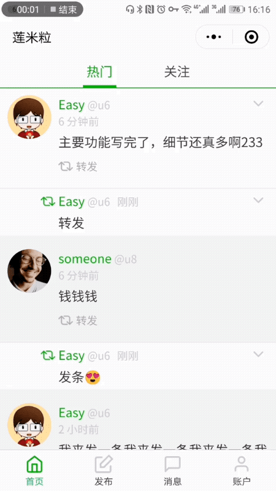

# 莲米粒 🎈 LianmiLite
莲米粒是一个基于PHP+MySQL+微信小程序技术栈的、拥有用户登入、发布、修改、删除和转发信息、以及私信聊天模块的信息流应用。



其目的有两个，首先是作为二次开发的基础项目。绝大部分应用、即使是工具类的，一旦用户变多以后，就会有添加私信和信息流系统的需求。你可以在这个系统上加上业务模块，很快的修改出一个可用的、带社会化属性的产品。

其次，用于教学和演示。目前市面上的绝大部分小程序教程，都只是找一个现成的API，主要讲解如何构建界面。莲米粒是一个同时实现了前后端的应用，不但包括了后端实现，更处理了微信用户和系统自有用户整合、自动登入等让新人棘手的流程，是一个不错的参考。希望能帮到大家。

## 安装说明

### 首先配置数据库
1. 建立一个数据库，导入 `api/docs/lianmilite.sql`
2. 打开 `api/config/database.php` , 填写数据库相关信息

### 启动API

API 需要rewrite。

#### 本地测试时：
1. `cd api`
2. 创建 `config/hide.php`，内容为
```
<?php
$GLOBALS['lpconfig']['wechat_miniapp_id'] = '小程序appid';
$GLOBALS['lpconfig']['wechat_miniapp_secret'] = '小程序appsecret';
```
3.启动测试服务器
```php -S localhost:8000 route.php```
注意要带 `route.php` 参数，不然不支持 rewrite。


#### 线上部署时
修改 `api/sample.htaccess` 为 `.htaccess` 后可用于 Apache 配置。

### 小程序部分

#### 启动
用微信开发者工具打开 `mini` 目录，修改 `appid` 即可。

#### 修改API接口地址
如要修改API地址，打开`mini/app.js`修改最后一行。


# 机翻英文 | English intro that machine translated

#莲米粒 🎈 LianmiLite
LianmiLite is a timeline application based on the PHP+MySQL+WeChat mini programe stack with user login, publish, modify, delete and retweet feed, and private message chat module.


Its purpose is two, first of all as a basic project for secondary development. Most applications, even those of the tool category, will have the need to add private messages and timeline function once the number of users has increased. You can add business modules to this system and quickly modify a product that is available with social attributes.

Second, for teaching and presentation. Most of the small program tutorials on the market today are just looking for a ready-made API that explains how to build an interface. lianmilite is an application that realizes both front and back ends. It not only includes the back-end implementation, but also handles the process of making WeChat users and system users integrated, automatic login and so on. It is a good reference. I hope I can help you.

## Installation Notes

### First configure the database
1. Create a database and import `api/docs/lianmilite.sql`
2. Open `api/config/database.php` and fill in the database related information.

### Launch API

The API requires rewrite.

#### When testing locally:
`cd api`
2. Create `config/hide.php` with the content
```
<?php
$GLOBALS['lpconfig']['wechat_miniapp_id'] = 'small appid';
$GLOBALS['lpconfig']['wechat_miniapp_secret'] = 'small appsecret';
```
3. Start the test server
```php -S localhost:8000 route.php```
Note that you should bring the `route.php` parameter, otherwise rewrite is not supported.


#### Online deployment
Modify `api/sample.htaccess` to `.htaccess` for Apache configuration.

### mini program

#### start up
Open the `mini` directory with the WeChat Developer tool and modify `appid`.

#### Modify API interface address
To modify the API address, open `mini/app.js` to modify the last line.